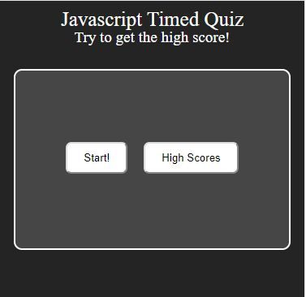
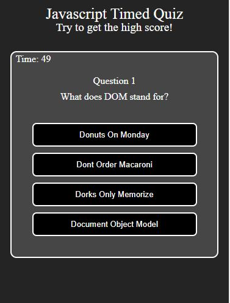
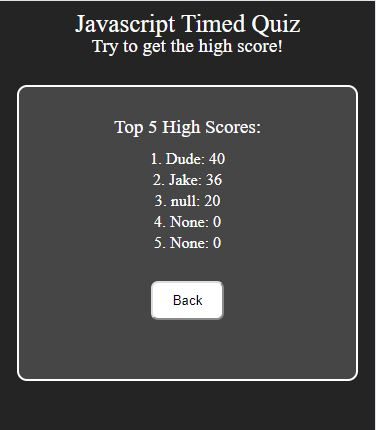
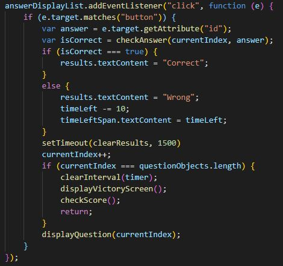
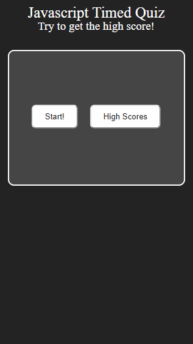

# hw-04-WebAPIs
Homework Week 4 WebAPIs

Description: This week our homework was designed to test our ability to navigate the DOM,
use timeouts and intervals, and handle events and event delegation. Creating a proper base HTML
page and using JavaScript to fill in the necessary information through DOM commands was essential
to succeeding at this task.

The quiz starts out with just a start button. One pressed, a timer is started and a question is presented.
You have 60 seconds to answer the 8 questions, but every wrong answer subtracts 10 seconds from your time.
Top 5 high scores are saved and displayed when the High Scores button is pressed.

Here is the basic webpage, shown rendered on an iPhone X, then by a PC. Notice how things scale differently:  

And here is a picture of what the questions looked like, with the timer rolling:  

The high score screen keeps track of high scores using local memory:  

There were several important pieces of code needed to make this work. One example is event listening and
delegations as shown here:  

Another essential piece of code was using local storage to keep track of high scores, even if the page
was closed or reset:  

Finally, a peak at it all coming together, renderd on an iPhone 5:  
